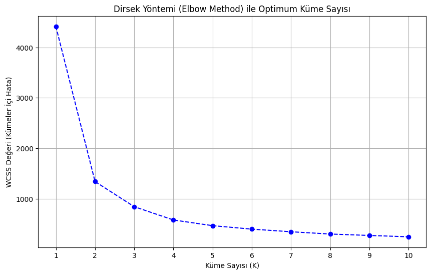
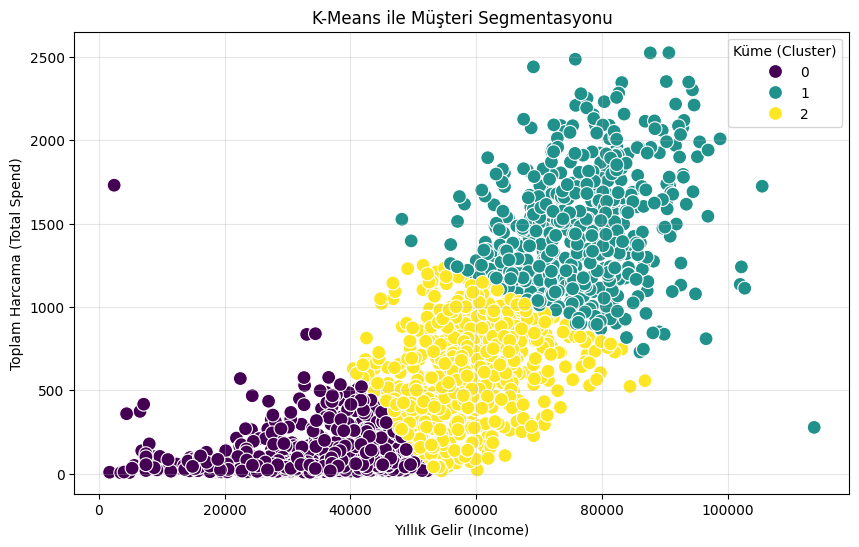

<h1 align="center">🎯 Müşteri Segmentasyonu (K-Means Clustering)</h1>

  
  
  
  

## 🎓 Proje Hakkında
Bu proje, **Huawei & Türkiye Yapay Zeka Akademisi Data Science Bootcamp** bitirme çalışması kapsamında geliştirilmiştir. Çalışmanın temel amacı; müşterilerin harcama alışkanlıklarındaki gizli örüntüleri keşfetmek ve K-Means makine öğrenmesi algoritmasını kullanarak veri odaklı pazarlama stratejileri geliştirmektir.

🔗 **[Medium Makalemi Oku: Verinin Gücüyle Müşterileri Tanımak] https://medium.com/@nidazbey/verinin-g%C3%BCc%C3%BCyle-m%C3%BC%C5%9Fterileri-tan%C4%B1mak-k-means-ile-m%C3%BC%C5%9Fteri-segmentasyonu-78314b4104bf**

🏆 **[Bootcamp Sertifikamı Görüntüle](bootcamp_sertifikasi.png)**

---

## ⚙️ Proje Geliştirme Adımları

1. **Veri Ön İşleme:** Veri setindeki eksik (NaN) ve aykırı (Outlier) değerler tespit edilerek temizlendi.
2. **Özellik Mühendisliği (Feature Engineering):** Müşterilerin farklı kategorilerdeki harcama verileri toplanarak `Total_Spend` (Toplam Harcama) adında tek ve anlamlı bir değişkene dönüştürüldü.
3. **Veri Ölçeklendirme:** K-Means algoritmasının uzaklık hesaplamalarını doğru yapabilmesi için verilere `StandardScaler` uygulandı.
4. **Kümeleme (Clustering):** Modelin eğitilmesi aşamasında optimum küme sayısı Dirsek (Elbow) Yöntemi ile belirlendi ve segmentasyon işlemi tamamlandı.

---

## 📊 Görselleştirmeler ve Model Analizi

### 1. Dirsek (Elbow) Yöntemi ile Optimum Küme Sayısının Belirlenmesi
K-Means algoritmasında en iyi sonucu verecek küme sayısını (K) belirlemek amacıyla inersiya (inertia) değerleri hesaplanarak aşağıdaki grafik çizdirilmiştir. Grafikteki keskin düşüşün yavaşladığı ve "dirsek" görünümünün oluştuğu kırılma noktası incelendiğinde, projemiz için en uygun küme sayısının **K=3** olduğu tespit edilmiştir.

  

### 2. K-Means Müşteri Segmentlerinin Dağılımı
Modelin eğitilmesi sonucunda müşteriler; gelir seviyeleri ve harcama alışkanlıkları baz alınarak üç farklı segmente ayrılmıştır. Aşağıdaki dağılım (scatter) grafiği, bu üç farklı müşteri profilinin veri uzayındaki konumlarını ve kümelerin birbirlerinden nasıl ayrıştığını net bir şekilde göstermektedir:

  

---

## 🚀 Sonuçlar ve Aksiyon Planı (Müşteri Segmentleri)

| Segment | Profil Özeti ve Pazarlama Stratejisi |
| :--- | :--- |
| 🥉 **Grup 0 (Düşük Gelir / Düşük Harcama)** | Yıllık geliri nispeten daha düşük olan ve platformda az harcama yapan, fiyat hassasiyeti yüksek müşteri grubudur. Bu kitleye indirim kuponları ve uygun fiyatlı kampanyalar sunulmalıdır. |
| 🥈 **Grup 1 (Orta Gelir / Orta Harcama)** | Platformun ana kitlesini oluşturan, düzenli ama dengeli alışveriş yapan sadık müşterilerdir. |
| 🥇 **Grup 2 (Yüksek Gelir / Yüksek Harcama)** | Bizim için en değerli segment olan premium müşterilerdir. Bu gruba VIP müşteri hizmetleri, lüks ürün kategorilerinden özel tavsiyeler ve prestijli kampanyalar sunarak elde tutma oranı artırılabilir. |

---

  <i>Geliştirici: Nida Özbey | Bilgisayar Mühendisliği Öğrencisi</i>

